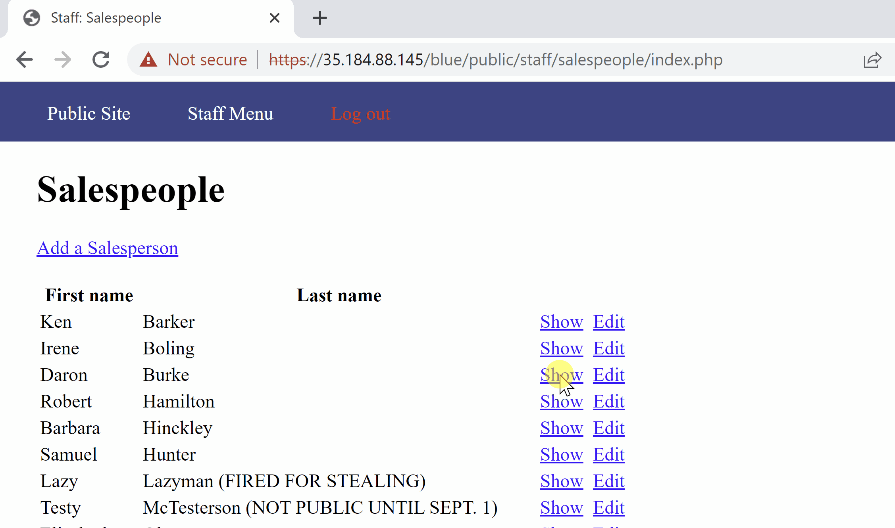
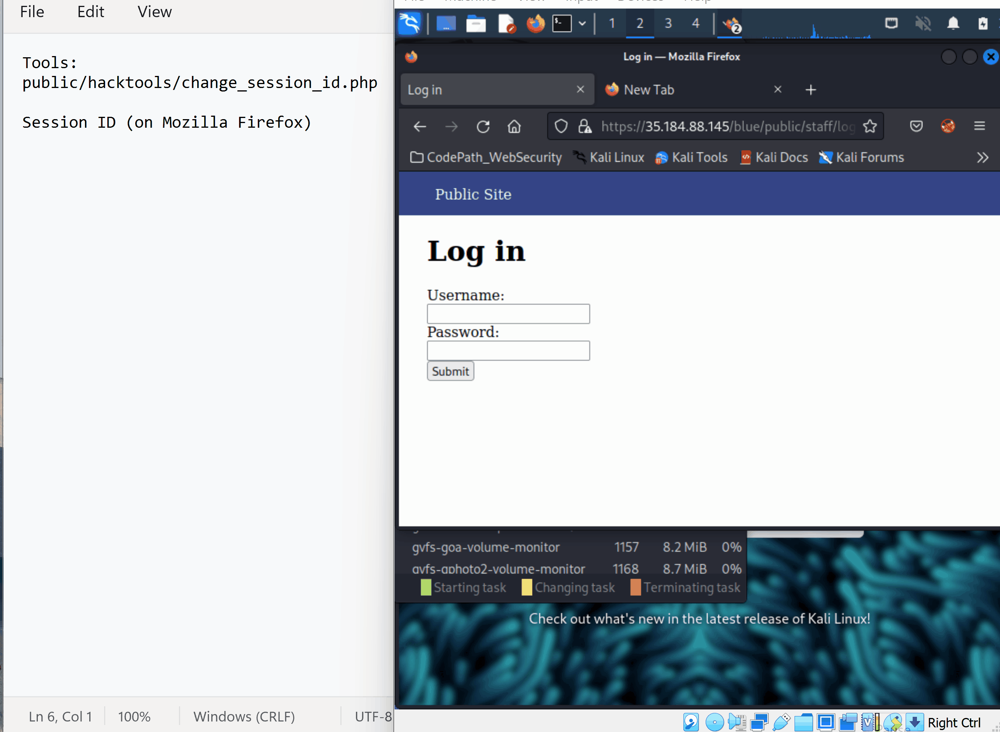
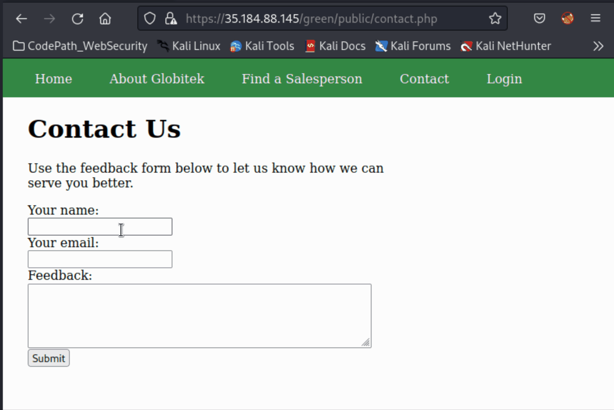
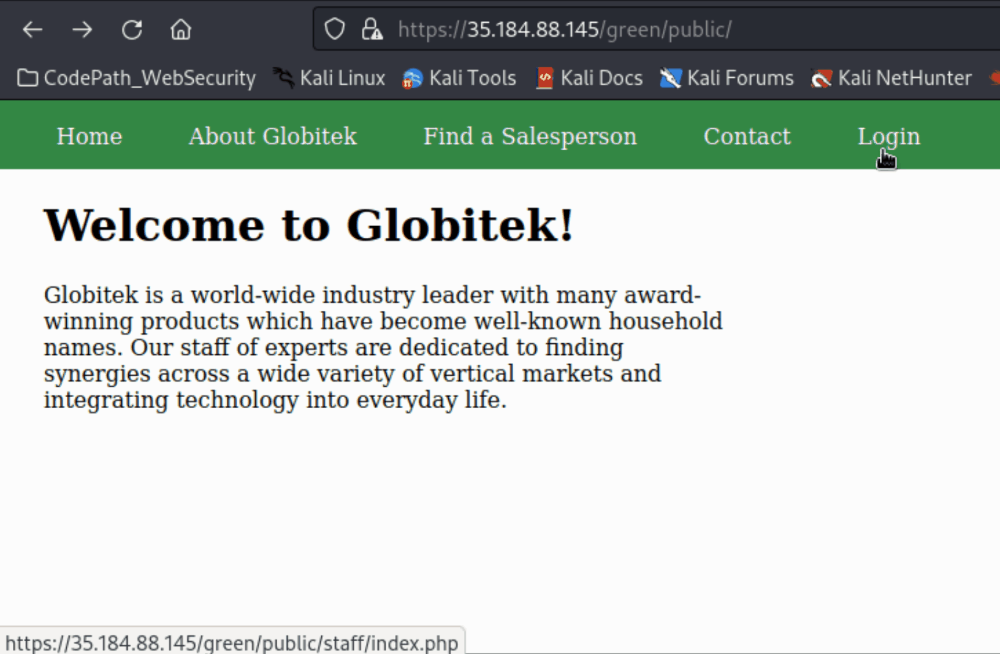
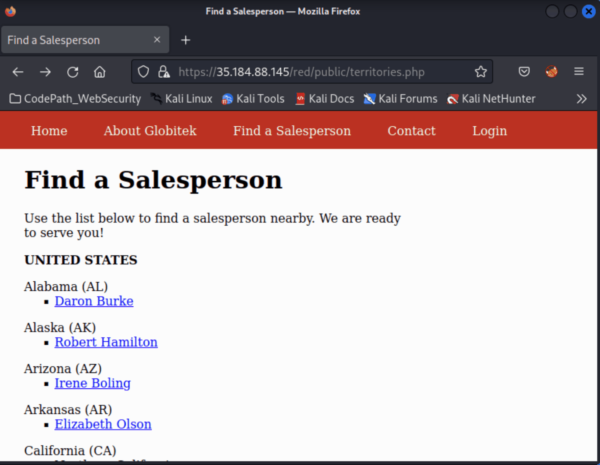
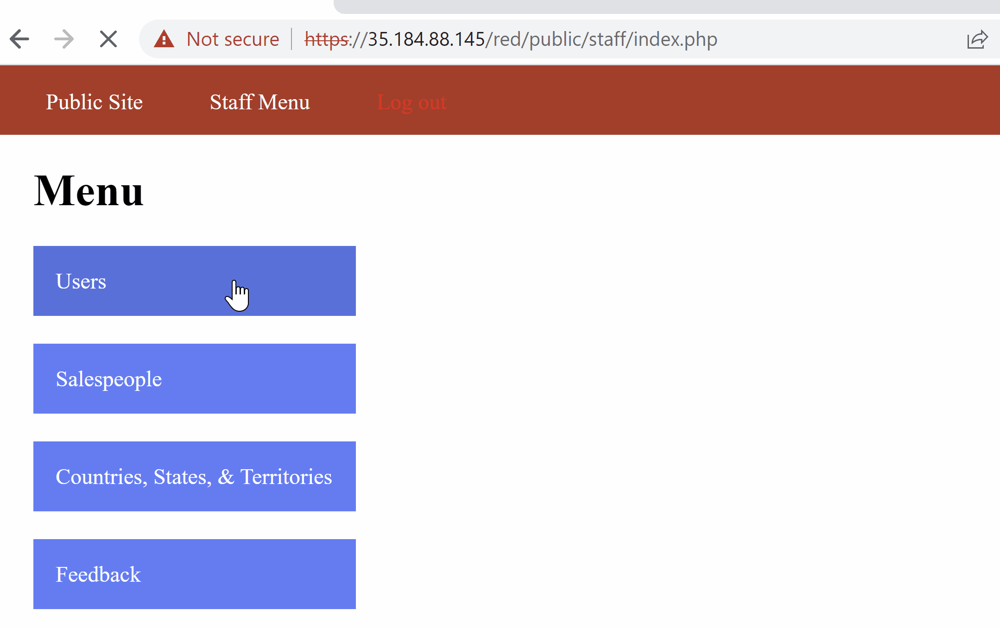

# Pen Testing Live Targets

Time spent: **X** hours spent in total

> Objective: Identify vulnerabilities in three different versions of the Globitek website: blue, green, and red.

The six possible exploits are:

* Username Enumeration
* Insecure Direct Object Reference (IDOR)
* SQL Injection (SQLi)
* Cross-Site Scripting (XSS)
* Cross-Site Request Forgery (CSRF)
* Session Hijacking/Fixation

Each color is vulnerable to only 2 of the 6 possible exploits. First discover which color has the specific vulnerability, then write a short description of how to exploit it, and finally demonstrate it using screenshots compiled into a GIF.

## Blue

Vulnerability #1: SQL Injection (SQLi)

Description:
* The sites's url: https://35.184.88.145/blue/public/salesperson.php?id=6 is vulnerable to sql injections. The url's id parameter can be modified with sql injection commands, as demonstrated below. 
* The site did not properly sanitize the salesperson.php query.
* Injected the following SQL commands for testing: 
```
    1'OR 1=1' 
```
```
   'or 1=1  
```
```
   'or SLEEP(5)=0--'
```
* The last sql command from above cause the database command to wait for 5 seconds while querying the database.

* Gif Walkthrough: 
                     


Vulnerability #2: Session Hijacking

Description:

* The current session ID of authenticated user can be obtained through a PHP script "public/hacktools/change_session_id.php" provided by codepath and used by an attacker to bypass user login.
* We can use burp to intercept the attacker's login attempt and replace the session ID with the one from an authenticated user.
* Once the intercepted login attempt is forwarded via burp, the attacker's screen is logged in with authenticated user's session ID. 
* The site allows sessions to be a year old, and never regenerates the session ID, even when the user agent string changes. This makes it vulnerable to both session hijacking and session fixation attacks.

* Gif Walkthrough: 



## Green

Vulnerability #1: Cross-Site Scripting (XSS)

Description:

* A stored XSS vulnerability is found at /green/public/contact.php where attackers can inject an XSS in the site's feedback form. 
* Injected XSS command: 
```
    <script>alert('Jasmine found the XSS!');</script>
```
* The XSS script will run and a alert message will be displayed on the screen when an an admin user visits the feedback page.

* Gif Walkthrough:
 


Vulnerability #2: Username Enumeration

Description:

* The green website is vulnerable to Username Enumeration because site's failure to login error message: "Log in was unsucessfull" is different for valid usernames and invalid usernames. 
* When we try to log in with an invalid username and password, the error message displayed was not bolded.
* However, when we try to log in with a valid username such as " jmonroe99 " and an invalid password, the same error message becomes bolded.  
* This allows us to collect a list of valid usernames and we can use that to perform a brute force password attack on the webiste.  
* Chrome's debugging tool shows that the site assigns two different classes "failure" and "failed" to the failure login error message depending on whether the username name is valid or not. Bolded font is applied to the former class but not the latter. 

* Gif Walkthrough:



## Red

Vulnerability #1: Insecure Direct Object Reference (IDOR)

Description:
* Attackers could modify the id parameter of the site's url to access some sensitive information that is not supposed to be public. 
* The salesperson page only displayed information for id = 1, 2, 3, 4, 5, 6, 7, 8, 9. 
* Below are the salesperson accounts that attackers is able to access: (see gif)  
```
  - ID: 10 NAME: Testy McTesterson (NOT PUBLIC UNTIL SEPT. 1)  <!-- Illegal access -->
  - ID: 11 NAME: Lazy Lazyman (FIRED FOR STEALING)             <!-- Illegal access -->
  - ID: 12 NAME: John Wick                                     <!-- Illegal access -->
```
* The other two green and blue websites have implemented access controls where a reference to a direct object is checked for each instance.
* The red site did not properly redirect user back to the public salesperson list page when the id parameter for the url is 10, 11, and 12.

* Gif Walkthrough:




Vulnerability #2: Cross-Site Request Forgery (CSRF)

Description:

* Created a malicious script that utilizes the logged in user's access permissions to forge a request to the site's database.
* The malicious script is an auto-submitting form that performs a post request and will midify a user's first name and last name.
* See csfr-form.html for the malicious script.
* Posted the link to the malicious script on the site's contact form. 
* When an admin user logged in and follows the link will modify the information of another user in the database.
* The site does not have CSRF protections on the admin area.

* Gif Walkthrough:



## Resources

GIFs created with [ScreenToGif](https://www.screentogif.com/) 


## Notes

Describe any challenges encountered while doing the work
