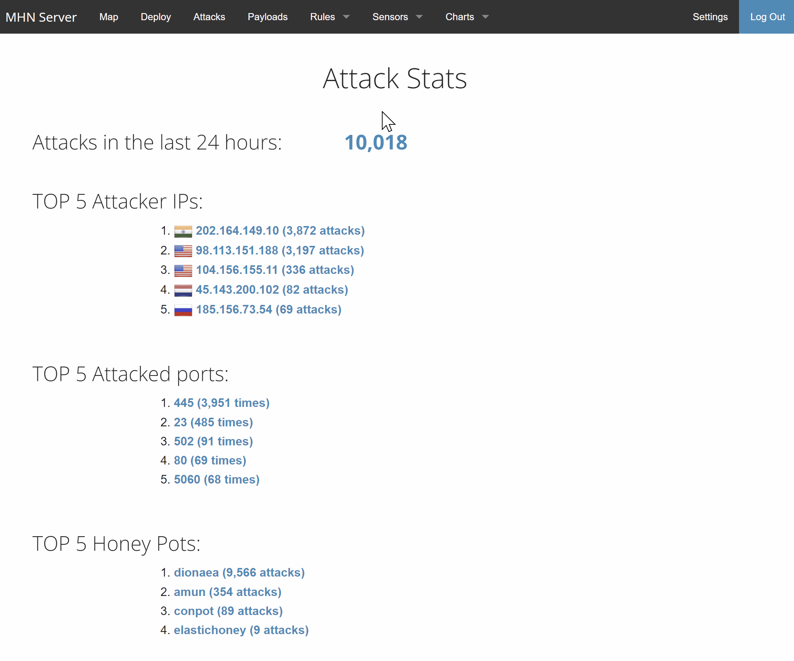
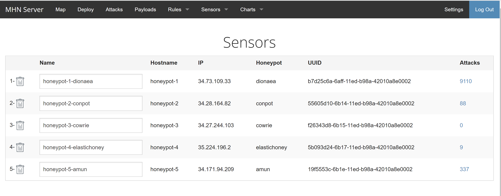

# Unit 10 & 11 Project: Honeypot Assignment

**Time spent: 10 hours spent in total

**Objective:** Create a honeynet using MHN-Admin. Present your findings as if you were requested to give a brief report of the current state of Internet security. Assume that your audience is a current employer who is questioning why the company should allocate anymore resources to the IT security team.

### MHN-Admin Deployment (Required)

**Summary:** I deployed MHN-admin application on GCP .
- Please see gif for the steps. 


### Dionaea Honeypot Deployment (Required)

**Summary:** Dionaea is a low-interaction honeypot that is used to trap malware samples and attack payloads. It is meant to be a nepenthes successor, embedding python as scripting language, and uses libemu to detect shellcodes. It supports ipv6 and tls.

- Please see gif for the steps. 




### Database Backup (Required) 

**Summary:** MHN-Admin uses MongoDB to store the data collected from honeypots. The exported JSON file records the following attributes: 
 - id, protocol, hpfeed_id, timestamp, source_ip, source_port, destination_port, identifier, and the name of honeypot.
 - Below is an sample record:
```
{
  "_id": {
    "$oid": "637dca97616a1e6699d1e522"
  },
  "protocol": "pcap",
  "hpfeed_id": {
    "$oid": "637dca95616a1e6699d1e521"
  },
  "timestamp": {
    "$date": "2022-11-23T07:24:05.819Z"
  },
  "source_ip": "5.188.206.102",
  "source_port": 47478,
  "destination_port": 52590,
  "identifier": "b7d25c6a-6aff-11ed-b98a-42010a8e0002",
  "honeypot": "dionaea"
}
```
* A total of 12090 records were exported from my honeypots. See the uploaded session.json for the complete list.*
### Deploying Additional Honeypot(s) (Optional)

#### I deployed additonal 4 honeypots. 

- Cowrie
- Conpot
- ElasticHoney
- Amun



### Malware Capture and Identification (Optional)

#### X Malware

**Summary:** How did you find it? Which honeypot captured it? What does each malware do?

MD5 Hash: *Run `md5sum` on the file and record the hash here.*

SHA1 Hash: *Run `sha1sum` on the file and record the hash here.*


## Resources

GIFs created with [ScreenToGif](https://www.screentogif.com/) 

## Notes

Describe any challenges encountered while doing the assignment.
