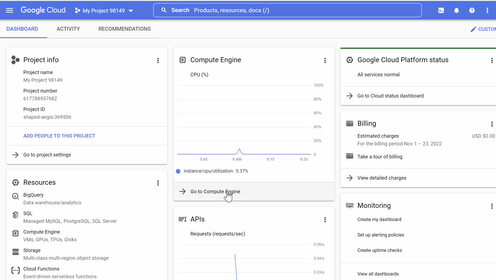

# Unit 10 & 11 Project: Honeypot Assignment

**Time spent: 12 hours spent in total

**Objective:** Create a honeynet using MHN-Admin. Present your findings as if you were requested to give a brief report of the current state of Internet security. Assume that your audience is a current employer who is questioning why the company should allocate anymore resources to the IT security team.

### MHN-Admin Deployment (Required)

**Summary:** I deployed MHN-admin application on GCP .
- Please see gif for the steps. 



### Dionaea Honeypot Deployment (Required)

**Summary:** Dionaea is a low-interaction honeypot that is used to trap malware samples and attack payloads. It is meant to be a nepenthes successor, embedding python as scripting language, and uses libemu to detect shellcodes. It supports ipv6 and tls.

- Please see gif for the steps. 


### Database Backup (Required) 

**Summary:** MHN-Admin uses MongoDB to store the data collected from honeypots. The exported JSON file records the following attributes: 
 - id, protocol, hpfeed_id, timestamp, source_ip, source_port, destination_port, identifier, and the name of honeypot.
 - Below is an sample record:
```
{
  "_id": {
    "$oid": "637dca97616a1e6699d1e522"
  },
  "protocol": "pcap",
  "hpfeed_id": {
    "$oid": "637dca95616a1e6699d1e521"
  },
  "timestamp": {
    "$date": "2022-11-23T07:24:05.819Z"
  },
  "source_ip": "5.188.206.102",
  "source_port": 47478,
  "destination_port": 52590,
  "identifier": "b7d25c6a-6aff-11ed-b98a-42010a8e0002",
  "honeypot": "dionaea"
}
```
* A total of 12090 records were exported from my honeypots. See session.json file uploaded to this GitHub repofor the complete list.*
### Deploying Additional Honeypot(s) (Optional)

#### I deployed additonal 4 honeypots. 

- Cowrie
- Conpot
- ElasticHoney
- Amun


### Malware Capture and Identification (Optional)

#### X Malware

**Summary:** I used VirusTotal to scan the malware. They were captured by a conpot honeypot.

MD5 Hash: *e4e0917720d827ef0fb579644e37bac8*

SHA1 Hash: *7a3b9f423dd2bef37f480728f4f46ab98a30e3d2*

SHA-256 Hash: *37aa42540bc375a6cf1c889dd05322a8516cbcc5f88e76463975ab25478688de*

Here is the gif:


**Summary:** Malware shown in the gif below were also captured by a conpot honeypot. 

MD5 Hash: *791be5467177745534ff841972ae74ca*

SHA1 Hash: *c876cacd5dcd1af6f5b96ca3a75e2e38898375ce*

SHA-256 Hash: *257afeeb48cae3cce150c6213ffd227b5842e7d9ef76076f9739714caa2d8ec8*
THer 
Here is the gif:


**Summary:** These malware were captured by a dionaea honeypot.


**Summary:** I also tried running the md5sum and sha1sum commands on the session.json file from my honeypots on Kali Linux. 

MD5 Hash: *5f7ca6f64902da38e938eaf18fd13762*

SHA1 Hash: **8e12a67af7291838dca4c897decf2f527a8e1e03*

I search these two hashes on VirusTotal and there were no match found.

Here is the gif:


## Resources

GIFs created with [ScreenToGif](https://www.screentogif.com/) 

[VirtusToal](https://www.virustotal.com/gui/home/search) was used to identify malware.

## Notes

Describe any challenges encountered while doing the assignment.
